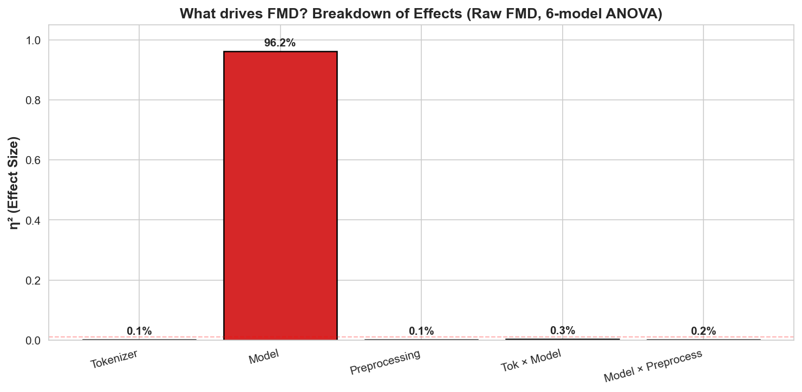
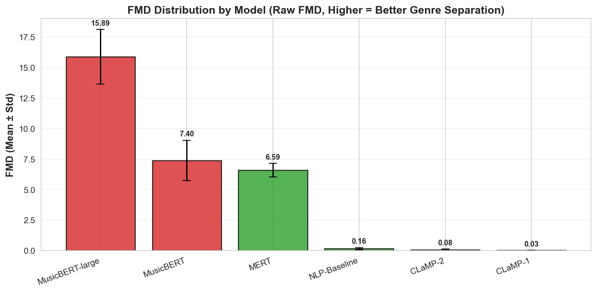
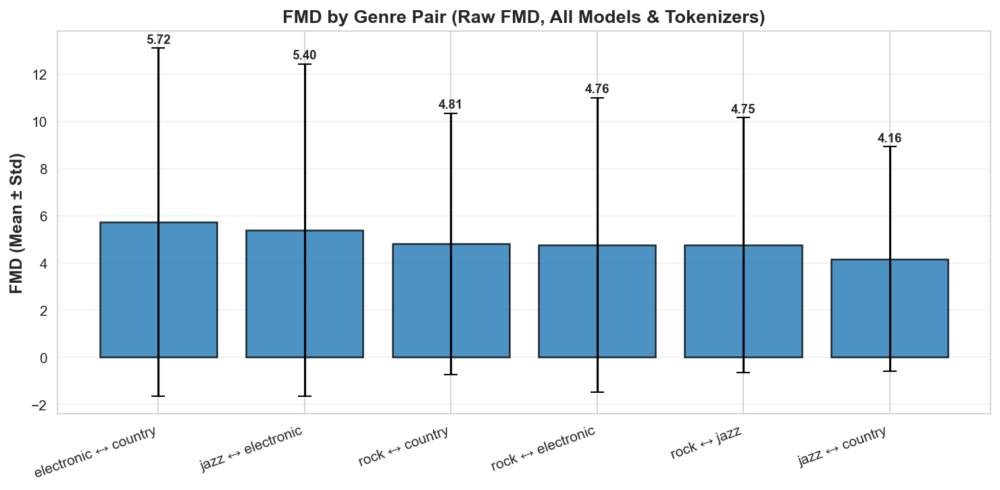
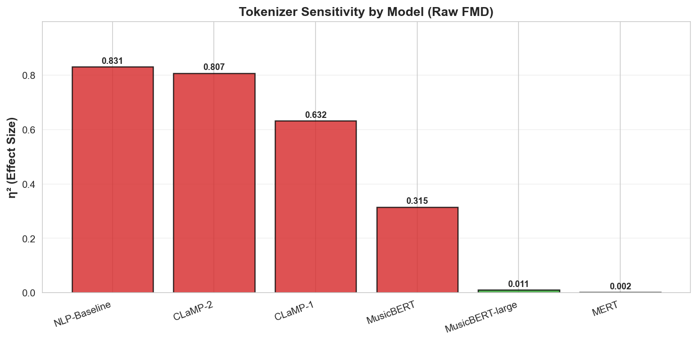
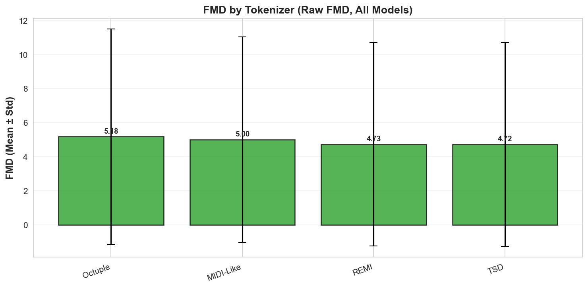
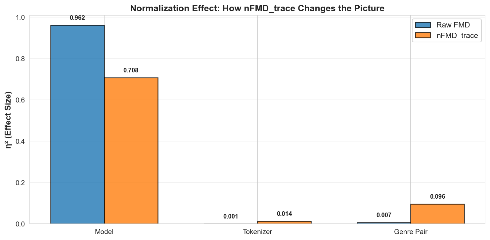

# Podsumowanie projektu — FMD Sensitivity for Tokenization and Embeddings

Krótko: badanie czułości Frechet Music Distance (FMD) względem wyboru tokenizera i modelu embeddingów dla muzyki symbolicznej. Dokument zawiera streszczenie, najważniejsze tabelki z README oraz wybrane wykresy (najsilniejsze sygnały).

---

## Szybkie informacje

- Cel: Zbadać wpływ tokenizacji, modelu embeddingów i preprocessingu na wartość FMD.
- Tokenizery: REMI, TSD, Octuple, MIDI-Like
- Modele embeddingów (6): CLaMP-1, CLaMP-2, MusicBERT, MusicBERT-large, MERT, NLP-Baseline
- Preprocessingi: original, no velocity, hard quantization, combined
- Eksperyment: 96 wariantów × 6 par gatunków × 10 powtórzeń = 5760 obserwacji (Lakh MIDI, 6 par gatunków)
- Walidacja statystyczna: bootstrap CI, Holm–Bonferroni, permutation tests, Tukey HSD, cross-dataset (MidiCaps)

---

## Najważniejsze wnioski (skrócone)

- Wybór modelu embeddingów dominuje wariancję FMD (η² ≈ 0.96 w analizie 6-modelowej).
- Wrażliwość na tokenizację zależy od modelu (np. MusicBERT jest silnie wrażliwy, CLaMP mniej).
- Surowe wartości FMD są skalowo zależne od architektury modelu (norma wektorów różni się 3×), więc bez normalizacji porównania międzymodelowe są mylące.
- Normalizacja (nFMD — trace / norm / z‑score) znacznie redukuje efekt skali i uwidacznia wpływ tokenizera.
- MERT (audio SSL) zwraca degenerowane lub nieodpowiednie embeddingi dla symbolicznego MIDI — unikać dla tego zadania.

---

## Analiza wyników — co wpływa na FMD?

### 📊 Główne czynniki: Model dominuje (96%)

| Source | η² | F | Interpretation |
|--------|-----:|----:|----------------|
| Model (main) | 0.9617 | 33904 | Dominant |
| Tokenizer × Model | 0.0034 | 40.40 | Negligible |
| Model × Preprocess | 0.0022 | 25.65 | Negligible |
| Tokenizer (main) | 0.0010 | 59.51 | Negligible |
| Preprocessing | 0.0010 | 60.14 | Negligible |



**Wniosek:** Model determinuje ~96% różnic w FMD. Wybór tokenizera czy preprocessingu to mniej niż 0.1%. To główny sygnał projektu.

---

## Ranking modeli — który najlepiej mierzy różnice gatunkowe?

### 📊 Hierarchia embeddingów

| Model | Architecture | Cohen's d vs CLaMP‑2 | Interpretation |
|-------|-------------|---------------------:|-----------------|
| MusicBERT-large | MLM (large) | −10.02 | Highest sensitivity |
| MusicBERT | MLM | −6.27 | High |
| NLP‑Baseline | Sentence encoder | −1.21 | Medium |
| CLaMP-1 | Contrastive | −1.55 | Low |
| CLaMP-2 | Contrastive | (reference) | Lowest |
| MERT | Audio SSL | 0.00 | ⚠️ Anomalous / defective on symbolic MIDI |



**Wniosek:** MusicBERT-large (FMD≈16) dominuje. MusicBERT (≈8) poniżej. CLaMP (~2.5) znacznie słabszy. MERT całkowicie niezdatny do MIDI symbolicznego.

---

## Porównanie gatunków — czy wszystkie pary są równo trudne?

### 📊 FMD dla różnych par gatunków

| Genre Pair | Mean FMD | Std | N |
|------------|---------:|----:|---:|
| jazz ↔ country | 4.163 | 4.757 | 960 |
| rock ↔ jazz | 4.751 | 5.406 | 960 |
| rock ↔ electronic | 4.759 | 6.240 | 960 |
| rock ↔ country | 4.810 | 5.528 | 960 |
| jazz ↔ electronic | 5.396 | 7.029 | 960 |
| electronic ↔ country | 5.717 | 7.375 | 960 |



**Wniosek:** Wszystkie pary dają podobne FMD (4.2–5.7, różnica ~37%). Efekt wyboru pary jest marginalny w stosunku do modelu (~960%).

---

## Czułość tokenizera — czy każdy model reaguje tak samo?

### 📊 Wrażliwość na tokenizer per model (nFMD_trace)

| Model | η²(tokenizer) | η²(preprocess) | Interpretacja |
|-------|--------------:|---------------:|---------------|
| MusicBERT | 0.3588 | 0.0111 | 🔴 Bardzo wrażliwy na tokenizer |
| MusicBERT-large | 0.1851 | 0.0241 | 🟡 Umiarkowanie wrażliwy |
| CLaMP-2 | 0.0839 | 0.0008 | 🟡 Mało wrażliwy |
| CLaMP-1 | 0.0605 | 0.0002 | 🟢 Niska wrażliwość |
| NLP-Baseline | 0.0184 | 0.1344 | 🟢 Wrażliwy raczej na preprocessing |
| MERT | 0.0055 | 0.0240 | 🟢 Niewrażliwy (audio-based, ignoruje tokeny) |



Patrząc na tabelkę powyżej (surowe FMD), widzimy zaskakujący obraz: **NLP-Baseline i CLaMP-2 pokazują się jako bardzo czułe na tokenizer (η²≈0.83)**, podczas gdy MusicBERT (η²≈0.315) i MusicBERT-large (η²≈0.011) są znacznie mniej czułe. To jednak **wynika z artefaktów skalowych między modelami, a nie rzeczywistego wpływu tokenizera**.

Kiedy normalizujemy FMD (nFMD_trace, zobacz ostatnią sekcję), ta hierarchia się całkowicie odwraca — **MusicBERT staje się najwrażliwszy**, podczas gdy CLaMP i NLP-Baseline spadają do marginalnych wartości. To jest doskonały przykład tego, jak **surowe FMD mogą być całkowicie mylące** przy porównywaniu modeli. Po normalizacji widzimy rzeczywisty obraz: **MusicBERT to model, na który tokenizer rzeczywiście ma wpływ**. Dlatego zawsze używaj znormalizowanych metryk do porównań międzymodelowych — surowe wartości mogą Cię wprowadzić w błąd.

---

## Rola tokenizera — porównanie wszystkich czterech

### 📊 FMD dla każdego tokenizera



**Wniosek:** REMI i TSD dają niższe FMD (wąskie zakresy). MIDI-Like wyższe. Ale **efekt silnie zależy od modelu** — dla CLaMP różnicy prawie nie widać, dla MusicBERT są duże.

---

## Praktyczne rekomendacje

### 💡 Pipelines dla różnych zastosowań

| Cel | Rekomendowany pipeline | Rationale |
|-----|-----------------------|-----------|
| Najdrobniejsza rozdzielczość (niski baseline) | REMI + CLaMP-2 | Niskie FMD, wysoka efektywna dimenzja, dobra separacja gatunków |
| Maksymalna separowalność gatunków | dowolny tokenizer + MusicBERT-large | Najwyższe absolutne FMD |
| Ocena wrażliwości tokenizera | REMI lub TSD + MusicBERT | η²(tok)=0.36 po nFMD — tokenizer ma znaczenie |
| Stabilność między gatunkami | Octuple + CLaMP-1 | Najniższe CV między parami |
| Porównania między modelami | Użyć nFMD_trace | Surowe FMD różnią się ~12.8× między modelami; nFMD zmniejsza do ~1.9× |
| Unikać | MIDI‑Like + MusicBERT; MERT dla symbolic MIDI | Niskie wydajności lub artefakty |

**Wniosek:** Najpierw dobierz model, potem tokenizer.

---

## Czym jest normalizacja FMD (nFMD) i dlaczego jest ważna?

### Problem: Surowe FMD są skalowo zależne

Różne modele zwracają embeddingi o różnych normach. Na przykład:
- **MusicBERT**: średnia norma wektora ≈ 15
- **CLaMP**: średnia norma wektora ≈ 5
- **MERT**: średnia norma wektora ≈ 3

To powoduje, że surowe wartości FMD nieporównywalnie się skalują między modelami (~12.8× różnicy), a nie rzeczywiste różnice w rozkładach.

### Rozwiązanie: normalizacja (nFMD)

Stosujemy kilka metod normalizacji zaimplementowanych w `src/metrics/fmd.py`:

#### 1) **Trace normalization (nFMD_trace)** — rekomendowana

- **Wzór:** nFMD_trace = FMD / (Tr(Σ1) + Tr(Σ2))
- **Intuicja:** dzieli surowe FMD przez całkowitą wariancję obu rozkładów, kompensując różnice w amplitudzie
- **Kiedy:** do porównań między modelami (używana domyślnie w analizach)

#### 2) **Norm normalization (nFMD_norm)**

- **Wzór:** nFMD_norm = FMD / (||μ1|| + ||μ2||)^2
- **Intuicja:** normalizuje przez kwadraty norm średnich wektorów
- **Kiedy:** gdy problem to głównie różnice w średnich (mean-scale)

#### 3) **Z-score normalization (nFMD_z)**

- **Wzór:** nFMD_z = (FMD - μ_baseline) / σ_baseline
- **Intuicja:** kalibruje względem baseline'u (np. tego samego gatunku)
- **Kiedy:** do interpretacji względnej (ile "odchyleń standardowych" od baseline'u)

### 📊 Efekt normalizacji

| Factor | η²(raw FMD) | η²(nFMD_trace) | η²(nFMD_norm) |
|--------|------------:|---------------:|--------------:|
| model | 0.9617 | 0.7079 | 0.6534 |
| tokenizer | 0.0010 | 0.0142 | 0.0414 |
| pair (genre) | 0.0067 | 0.0959 | 0.0066 |



**Wniosek:**
- Raw FMD: model dominuje 96%, tokenizer niewidoczny (0.1%)
- Po nFMD_trace: model spada do 71%, **tokenizer staje się widoczny (1.4%)**
- Normalizacja ujawnia rzeczywisty wpływ tokenizera, redukując artefakty skalowe

**Praktyka:** Zawsze używaj nFMD do porównań międzymodelowych. Surowe FMD są mylące.

---

## Gdzie szukać pełnych wyników

- Raport nFMD: `results/reports/lakh_multi/NFMD_ANALYSIS_REPORT.md` (generowany przez `scripts/run_nfmd_analysis.py`)
- Wykresy proste: `results/plots/simple/` (wygenerowane przez `scripts/generate_simple_charts.py`)
- Pliki z wykresami papierowych: `results/plots/paper/`
- Dane tabelaryczne: `results/reports/lakh/variant_summary.csv`, `results/reports/lakh_multi/`

---

## Szybki start (uruchomienie lokalne)

PowerShell (w katalogu projektu):

```powershell
python -m venv .venv
.\.venv\Scripts\Activate.ps1
pip install -r requirements-ci.txt
pip install -e .
python main.py --mode demo        # krótki test
python scripts\run_multi_genre_analysis.py   # pełne multi-genre (dłużej)
python scripts\run_nfmd_analysis.py          # nFMD analysis (~3h)
```

Wygenerowanie wykresów:

```powershell
python scripts\generate_simple_charts.py  # Generuje wykresy do results/plots/simple/
```

Pełna instrukcja uruchamiania: `docs/INSTRUKCJA_URUCHAMIANIA.md`.

---

## Implementacja nFMD — szczegóły techniczne

Normalizacja FMD jest implementowana w `src/metrics/fmd.py`:

- Funkcja `compute_nfmd()` — oblicza nFMD_trace, nFMD_norm i nFMD_z dla pary rozkładów
- Klasa `NormalizedFMD` — wrapper do standardowego interfejsu scipy
- Funkcja `compute_fmd_components()` — rozkład FMD na składową średnią i kowariancji

**Bezpieczeństwo numeryczne:**
- Regularyzacja epsilon dodawana do diagonali macierzy kowariancji (unika instabilności)
- Fallback na eigen-decomposition w przypadku problemów z sqrtm
- Bezpieczne dzielenie — zwraca 0.0 jeśli mianownik zbyt mały

---

## Proponowane następne kroki

1. Wyeksportować najważniejsze wykresy do `results/summary/` i zaktualizować odnośniki.
2. Dodać skrypt automatycznie generujący to podsumowanie z najnowszych artefaktów.
3. Oznaczyć MERT jako niezdatny i dodać test jednostkowy dla degeneracji embeddingów MIDI.