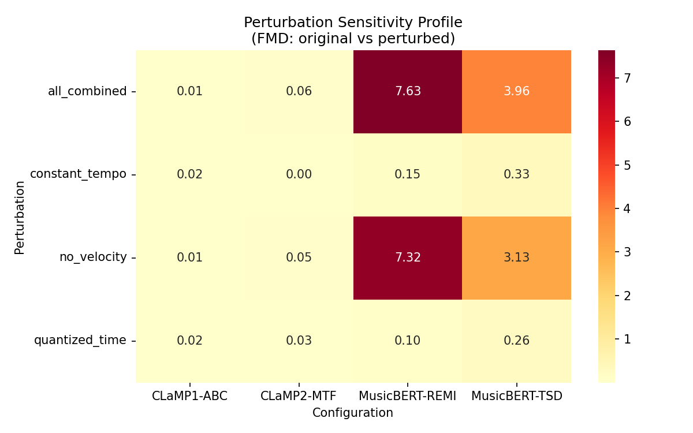
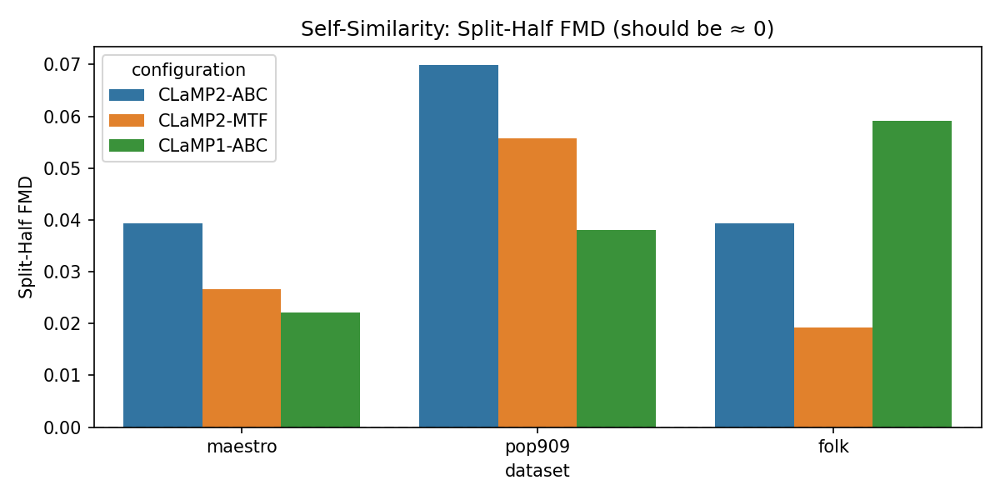
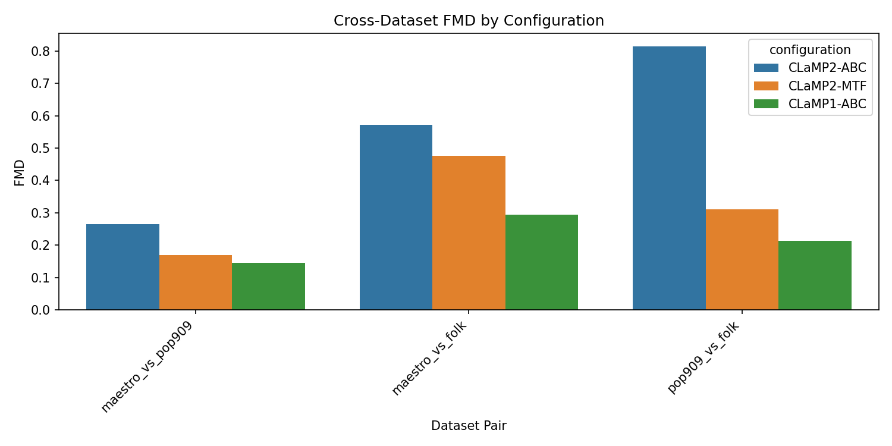
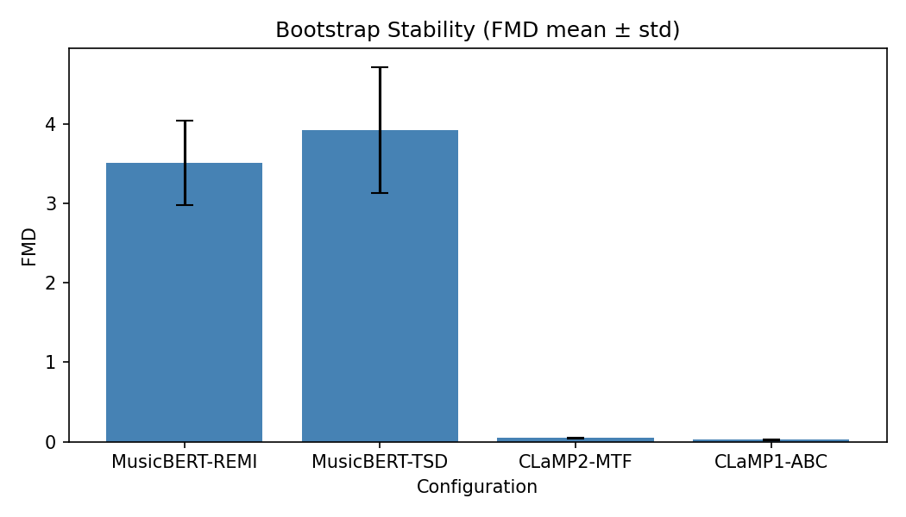

# 🎵 FMD Sensitivity to Tokenization and Embedding Configuration

<p align="center">
  <b>🔬 Sensitivity Profiling of Fréchet Music Distance for Symbolic Music Evaluation</b>
</p>

<p align="center">
  <a href="https://www.python.org/downloads/"></a>
  <a href="https://pytorch.org/"></a>
  <a href="#"></a>
  <a href="#"></a>
</p>

> 📖 An empirical study revealing how pipeline configuration choices (embedding model, input representation, preprocessing) alter what FMD actually measures — with practical recommendations for the music generation community.

---

## ⚡ TL;DR

We profiled how 3 FMD configurations react to controlled perturbations of MIDI data. **The key discovery:**

| Perturbation | CLaMP2-MTF | CLaMP2-REMI | CLaMP1-ABC |
|:-------------|:----------:|:-----------:|:----------:|
| 🔴 Remove velocity (dynamics) | **0.063** | 0.053 | 0.020 |
| 🟡 Quantize timing (16th grid) | **0.118** | 0.000 | 0.014 |
| 🟢 Constant tempo (120 BPM) | 0.000 | 0.000 | 0.015 |

> 🎯 **CLaMP-2 + MTF on MAESTRO detects velocity and timing; ABC is blind to both. Input format determines what FMD evaluates.**

<p align="center">
  
</p>

---

## 🔄 Motivation and Research Pivot

### ❌ Original Approach: Normalized FMD (nFMD) — Why It Failed

Our initial contribution was **Normalized FMD (nFMD)** — an attempt to make FMD values comparable across different embedding models by normalizing for embedding scale. We observed that raw FMD values differ by **12.8×** across models for the same genre pair simply due to embedding norm differences.

**🚫 Why nFMD is fundamentally flawed:**

| # | Argument | Explanation |
|:-:|:---------|:------------|
| 1️⃣ | **The problem doesn't exist meaningfully** | Each model lives in a different feature space. Forcing common scale ≠ measuring the same thing |
| 2️⃣ | **FMD/FID/FAD were never designed for cross-model comparison** | Fréchet distance works *within* a fixed space |
| 3️⃣ | **Normalization obscures rather than reveals** | Apparent "hidden effects" are likely division artefacts |
| 4️⃣ | **Precedent agrees** | FID and FAD have never been normalized in the literature |

We implemented nFMD experimentally but **rejected it** because it produces misleading results.

### ✅ Sensitivity Profiling

Instead of cross-model normalization, we asked:

> 💡 **"Given a fixed FMD configuration, what musical properties does the metric actually measure?"**

This produces **directly actionable knowledge:**

- 🎹 Evaluating expressive dynamics? → Use **CLaMP-2 + MTF**
- 🎼 Evaluating score-like / folk structure? → Use **CLaMP-1 + ABC** (not for velocity)
- ⏱️ Evaluating timing/microtiming? → **CLaMP-2 + MTF** (FMD = 0.12 on MAESTRO)

---

## 🧪 Experimental Design

### 🔧 3 Configurations

| Config | Model | Input format | Pipeline | Isolates |
|:------:|:-----:|:-------------|:---------|:---------|
| 🅰️ **CLaMP2-MTF** | CLaMP-2 | MTF | MIDI → MTF text (`mido`) → M3 patches | Native CLaMP-2 path |
| 🅱️ **CLaMP2-REMI** | CLaMP-2 | REMI | MidiTok REMI tokens → text → M3 patches | Tokenization effect (same model) |
| 🅲 **CLaMP1-ABC** | CLaMP-1 | ABC | MIDI → ABC (`music21`) → bar patches | Model effect |

Encoding details: `src/embeddings/clamp_formats.py`

### 🎶 4 Datasets (6 pairwise comparisons)

| Dataset | Style | Used in run | Source |
|:--------|:------|:-----------:|:-------|
| 🎹 **MAESTRO** | Classical piano | 80 files | [Google Magenta v3](https://storage.googleapis.com/magentadata/datasets/maestro/v3.0.0/maestro-v3.0.0-midi.zip) |
| 🎤 **POP909** | Pop songs | 80 files | [Music-X-Lab](https://github.com/music-x-lab/POP909-Dataset) |
| 🪕 **Folk** | Traditional folk tunes | 80 files | [Nottingham Dataset](https://github.com/jukedeck/nottingham-dataset) |
| 🎻 **MidiCaps classical** | Orchestral/classical | 80 files | [MidiCaps](https://huggingface.co/datasets/amaai-lab/MidiCaps) (tag: classical) |

4 datasets → C(4,2) = **6 pairs** — minimum for meaningful Spearman ranking comparison.

### 🎛️ 5 Perturbations (controlled expression removal)

| Perturbation | What it removes | Implementation |
|:-------------|:----------------|:---------------|
| ✨ `original` | Nothing (baseline) | — |
| 🔇 `no_velocity` | Dynamics/expression | All notes → velocity 64 |
| 📐 `quantized_time` | Microtiming/swing | Snap to 16th-note grid |
| ⏱️ `constant_tempo` | Rubato/tempo variation | Remap beats → 120 BPM |
| 💀 `all_combined` | All expression | All three combined |

---

## 📊 Results

Full Polish report: [`docs/SENSITIVITY_PIVOT_RESULTS.md`](docs/SENSITIVITY_PIVOT_RESULTS.md)

### ✅ Step 3: Self-Similarity Sanity Check

Split-half FMD (should be ≈ 0 if stable):

| Dataset | CLaMP2-MTF | CLaMP2-REMI | CLaMP1-ABC |
|:--------|:----------:|:-----------:|:----------:|
| 🎹 MAESTRO | 0.017 | 0.010 | 0.029 |
| 🎤 POP909 | 0.024 | 0.010 | 0.033 |
| 🪕 Folk | 0.094 | 0.011 | 0.026 |
| 🎻 MidiCaps classical | 0.129 | 0.039 | 0.034 |

> ✅ All values < 0.15. **Noise floor:** ~0.01–0.04 (REMI/ABC), ~0.02–0.13 (MTF).

<p align="center">
  
</p>

---

### 📈 Step 4: Cross-Dataset Ranking (6 pairs)

| Pair | CLaMP2-MTF | CLaMP2-REMI | CLaMP1-ABC |
|:-----|:----------:|:-----------:|:----------:|
| MAESTRO ↔ POP909 | 0.073 | 0.051 | 0.017 |
| MAESTRO ↔ Folk | **0.729** | 0.066 | 0.015 |
| MAESTRO ↔ MidiCaps classical | 0.272 | 0.077 | 0.015 |
| POP909 ↔ Folk | **0.624** | 0.102 | 0.016 |
| POP909 ↔ MidiCaps classical | 0.219 | 0.089 | 0.015 |
| Folk ↔ MidiCaps classical | 0.472 | 0.084 | 0.014 |

**Spearman τ (n = 6 pairs):**

| Pair | τ | Interpretation |
|:-----|:-:|:---------------|
| CLaMP2-MTF vs CLaMP2-REMI | 0.26 | ⚪ Moderate agreement |
| CLaMP2-MTF vs CLaMP1-ABC | **−0.37** | ⚠️ Rankings diverge |
| CLaMP2-REMI vs CLaMP1-ABC | −0.09 | ⚪ No agreement |

> 🔑 **Key finding:** MTF sees MAESTRO–Folk FMD = **0.73**; ABC flattens all pairs to ~0.015.

<p align="center">
  
</p>

---

### 🔬 Step 5: Perturbation Sensitivity ⭐ MAIN RESULT

FMD(original, perturbed) on MAESTRO. Higher = more sensitive:

| Perturbation | CLaMP2-MTF | CLaMP2-REMI | CLaMP1-ABC | Verdict |
|:-------------|:----------:|:-----------:|:----------:|:--------|
| 🔇 **no_velocity** | **0.063** | 0.053 | 0.020 | 🔴 MTF + REMI see dynamics |
| 📐 quantized_time | **0.118** | 0.000 | 0.014 | 🔴 Only MTF sees timing |
| ⏱️ constant_tempo | 0.000 | 0.000 | 0.015 | ⚪ Near noise floor |
| 💀 all_combined | **0.207** | 0.055 | 0.016 | MTF: velocity + timing |

#### 🔍 Analysis

| Finding | Details |
|:--------|:--------|
| 🔴 **Velocity** | MTF FMD = 0.063; REMI = 0.053; ABC = 0.020 on MAESTRO |
| 🟡 **Timing** | MTF FMD = **0.118** on MAESTRO; REMI/ABC at noise level |
| 🟢 **Tempo** | FMD < 0.02 for all configs |
| ⚫ **Combined (MTF)** | `all_combined` dominated by velocity + timing removal |

> 💡 **Key insight:** FMD sensitivity to expression depends on input format. ABC and REMI silently drop information that MTF preserves.

---

### 📉 Step 6: Bootstrap Stability

50× bootstrap (MAESTRO vs POP909, N = 80):

| Config | FMD mean ± std | 95% CI | CV |
|:-------|:--------------:|:------:|:--:|
| CLaMP2-MTF | 0.080 ± 0.004 | [0.073, 0.088] | 5.6% |
| CLaMP2-REMI | 0.055 ± 0.003 | [0.050, 0.062] | 6.2% |
| CLaMP1-ABC | 0.027 ± 0.003 | [0.021, 0.031] | 11.0% |

> 📊 MTF has highest absolute FMD (better separation) and lowest relative variance.

<p align="center">
  
</p>

---

## 🏆 Conclusions

### 📝 Main Contributions

| # | Contribution | Key number |
|:-:|:-------------|:-----------|
| 1️⃣ | **Sensitivity profiling methodology** — perturbation-based framework | 3 configs × 5 perturbations |
| 2️⃣ | **Input format determines sensitivity** — MTF detects velocity + timing | 0.063 / 0.118 vs ~0.02 |
| 3️⃣ | **Ranking depends on representation** — MTF vs ABC τ = −0.37 | 6 dataset pairs |
| 4️⃣ | **CLaMP encoding paths** — MTF (`mido`), ABC (`music21`), REMI (MidiTok) | See `clamp_formats.py` |
| 5️⃣ | **Rejection of nFMD** — negative result preventing dead-end research | — |

### 🎯 Practical Recommendations

| Goal | ✅ Use | ❌ Avoid | Why |
|:-----|:-------|:---------|:----|
| 🎹 Dynamics / expression | CLaMP-2 + MTF | CLaMP-1 + ABC | FMD = 0.063 vs 0.020 |
| 🎼 Score / folk structure | CLaMP-1 + ABC | — | Velocity-invariant by design |
| 📊 Stylistic distance ranking | CLaMP-2 + MTF | CLaMP-1 + ABC | ABC flattens performance gaps |
| ⏱️ Timing / microtiming | CLaMP-2 + MTF | CLaMP-1 + ABC, REMI | FMD = 0.118 vs ~0.00 |

---

## 🚀 Running the Experiments

> 🇵🇱 Szczegółowa instrukcja krok po kroku (Windows): [`docs/INSTRUKCJA_URUCHAMIANIA.md`](docs/INSTRUKCJA_URUCHAMIANIA.md)

### Full pipeline

```bash
python main.py --mode sensitivity
```

### Individual steps

```bash
python main.py --mode sensitivity --sensitivity-step self-similarity
python main.py --mode sensitivity --sensitivity-step ranking
python main.py --mode sensitivity --sensitivity-step perturbation
python main.py --mode sensitivity --sensitivity-step bootstrap
python main.py --mode sensitivity --sensitivity-step plots
```

### 📦 Dataset preparation

```bash
python main.py --mode fetch-data --datasets maestro pop909   # MAESTRO + POP909
python scripts/download_folk_dataset.py                      # Nottingham folk
# MidiCaps classical: HF download + extract midicaps.tar.gz, then:
python -c "import sys; sys.path.insert(0,'src'); from utils.config import load_config; from data.midicaps_loader import MidiCapsGenreLoader; c=load_config('configs/config.yaml'); c['cross_validation']['midicaps']['genres']=['classical']; MidiCapsGenreLoader(c).populate_raw_datasets()"
```

### 📁 Output

```
results/reports/sensitivity_pivot/
├── self_similarity.csv
├── cross_dataset_fmd.csv
├── spearman_ranking_agreement.csv
├── perturbation_sensitivity.csv
├── bootstrap_stability.csv
└── sensitivity_pivot_summary.json

results/plots/sensitivity_pivot/
├── perturbation_heatmap.png
├── cross_dataset_bar.png
├── bootstrap_stability.png
└── self_similarity.png
```

**Runtime:** ~116 min on CPU (80 files/dataset). Config: `configs/sensitivity_pivot.yaml`.

---

## 🗂️ Project Structure

```
src/
  ├── preprocessing/processor.py        # MIDI preprocessing + perturbations
  ├── tokenization/tokenizer.py         # REMI, TSD, Octuple, MIDI-Like (MidiTok)
  ├── embeddings/
  │   ├── clamp_formats.py              # MTF (mido), ABC (music21), M3 patching
  │   └── extractor.py                  # CLaMP-1/2, MusicBERT, MERT, NLP
  ├── metrics/fmd.py                    # Fréchet Music Distance
  └── experiments/
      ├── sensitivity_profiler.py       # Sensitivity profiling pipeline (7 steps)
      └── paper_pipeline.py             # Multi-model benchmark

configs/
  ├── config.yaml                       # Main project config
  └── sensitivity_pivot.yaml            # Sensitivity experiment config

results/
  ├── reports/sensitivity_pivot/        # CSV + JSON results
  └── plots/sensitivity_pivot/          # Publication figures
```

---

## 📚 Additional Modes

Extended analyses (Lakh MIDI validation, multi-model benchmark, cross-dataset validation):

```bash
python main.py --mode paper
python main.py --mode lakh
python main.py --mode cross-validate
```

---

## 📖 References

1. Retkowski, J., Stępniak, J., Modrzejewski, M. (2025). *Fréchet Music Distance: A Metric for Generative Symbolic Music Evaluation.*
2. Wu, Y., et al. (2023). *CLaMP: Contrastive Language-Music Pre-training.*
3. Wu, Y., et al. (2024). *CLaMP 2: Multimodal Music Information Retrieval.*
4. Fradet, N., et al. (2024). *MidiTok: A Python Package for MIDI File Tokenization.*
5. Heusel, M., et al. (2017). *GANs Trained by a Two Time-Scale Update Rule.* (FID)
6. Kilgour, K., et al. (2019). *Fréchet Audio Distance.* (FAD)

---

## 🎓 Academic Context

| | |
|:--|:--|
| 🏫 **Institution** | Warsaw University of Technology, EITI |
| 📚 **Course** | WIMU (Music Information Retrieval) |
| 👨‍💻 **Authors** | Michał Fereniec, Bartosz Sędzikowski
| 👨‍🏫 **Supervisor** | mgr inż. Tomasz Radzikowski |
| 📅 **Duration** | February–June 2026 |
| 🎤 **Presentation** | June 2026 |

---

<p align="center">
  <b>✅ Status: Results Complete</b> | 📅 Last Updated: 2026-06-08
</p>
