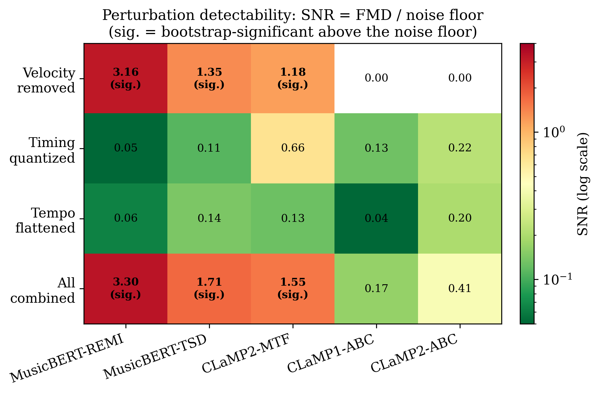
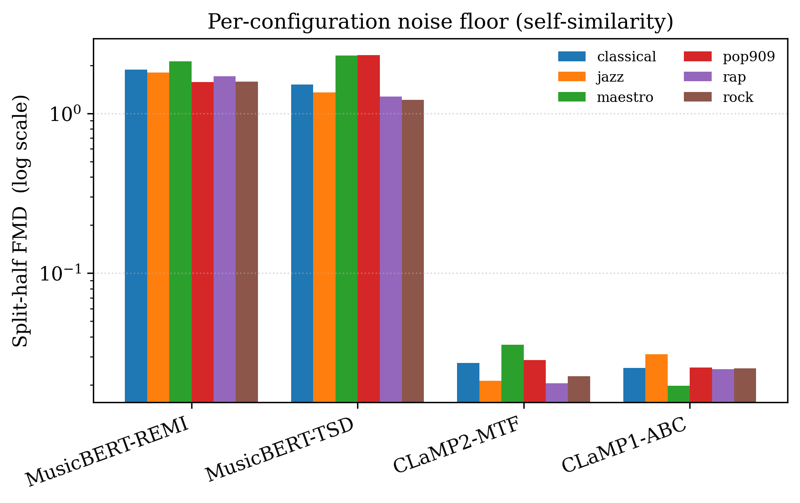
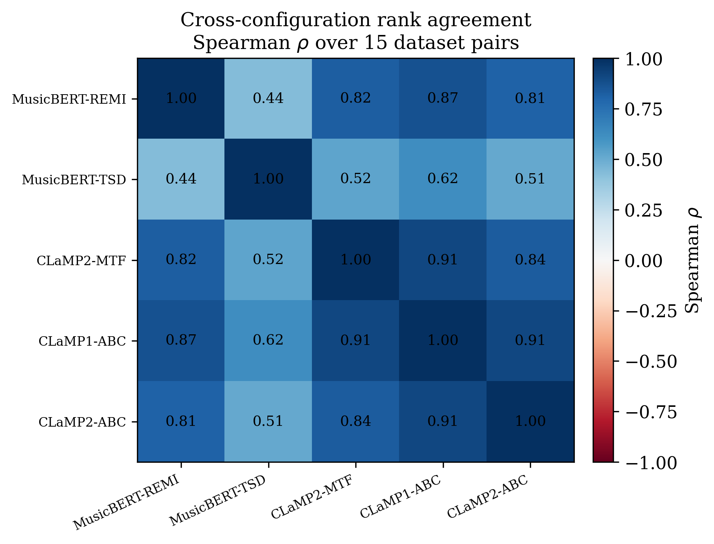

# 🎵 FMD Sensitivity to Tokenization and Embedding Configuration

<p align="center">
  <b>🔬 What does the Fréchet Music Distance actually measure? A sensitivity study across tokenizers and embedding models.</b>
</p>

<p align="center">
  <a href="https://www.python.org/downloads/"></a>
  <a href="https://pytorch.org/"></a>
  <a href="#"></a>
  <a href="#"></a>
</p>

> 📖 An FMD score is **not a property of the music alone** - it is produced by a *pipeline* (input representation → embedding model → Fréchet formula). We profile how that pipeline reshapes what FMD perceives, and give practical guidance for the music-generation community.

> 🧭 **Start here:** [`final_results.ipynb`](final_results.ipynb) - a step-by-step, executable tour of every result (reads only the CSVs, no models/GPU needed). The paper is [`draft.tex`](draft.tex).

---

## ⚡ TL;DR

We profiled **4 FMD configurations** across **6 datasets** (15 pairs) and **5 controlled perturbations** of MIDI. Three things stand out:

1. **🎚️ Input representation decides what FMD can see - causally.** Removing note velocity is the *only* perturbation that moves the embedding distribution above the sampling-noise floor (SNR > 1) - and only in representations that actually encode velocity (REMI/TSD tokens, CLaMP-2 MTF). Under ABC - which has **no velocity channel** - the perturbed rendering is character-identical and **FMD = 0.0000 exactly**. The **same-model control** nails it: CLaMP-2 detects velocity under MTF (SNR 1.18, p=0.02) and is *structurally* blind under ABC - same weights, same music, different representation. A **per-file Wilcoxon analysis** (p ≈ 1e-13 on both corpora) and a full **POP909 replication** (velocity SNR up to 4.15) confirm it.
2. **🤝 Corpus-level style rankings are robust across pipelines.** Despite radically different attribute sensitivity, **9 of 10 configuration pairs rank the 15 dataset pairs alike (ρ = 0.51-0.91; MTF ↔ ABC ρ = 0.907, p < 0.001)** - genre distances are carried by the pitch+rhythm core every representation shares. "Ranks styles sensibly" does **not** certify "sees the attribute you care about".
3. **⚠️ Raw FMD is NOT comparable across embedding models.** CLaMP embeddings are L2-normalised (unit sphere → small FMD); MusicBERT's are not (→ large FMD). The ~60× gap is geometry, not music - so we compare via **scale-invariant** statistics (SNR, Spearman, CV), never raw magnitude.

<p align="center">
  
</p>

---

## 🧭 What changed (and why)

An earlier version of this study mislabelled configurations (a "CLaMP-2 + REMI" entry that actually fed ABC) and computed rank statistics over too few points. This version fixes both:

| Problem (old) | Fix (now) |
|:--|:--|
| ❌ CLaMP fed REMI tokens it cannot natively consume | ✅ REMI/TSD tokens go to **MusicBERT** (a token model); CLaMP only gets its **native** MTF/ABC |
| ❌ Rank stats over 3 points (indefensible) | ✅ **6 datasets → 15 pairs**, Spearman now interpretable with real *p*-values |
| ❌ Single perturbation numbers, no test | ✅ Each perturbation gets **SNR + bootstrap CI + permutation *p*-value** |
| ❌ "CLaMP 63× more consistent" (a scale artifact) | ✅ Cross-config claims use **scale-invariant** SNR / Spearman / CV only |

---

## 🧪 Experimental Design

### 🔧 4 configurations + 1 same-model control (honest input semantics)

| Config | Model | Input | Isolates | Norm. |
|:------:|:-----:|:------|:---------|:-----:|
| 🅰️ **MusicBERT-REMI** | MusicBERT | MidiTok REMI tokens | tokenization baseline | no |
| 🅱️ **MusicBERT-TSD** | MusicBERT | MidiTok TSD tokens | tokenizer effect (same model) | no |
| 🅲 **CLaMP2-MTF** | CLaMP-2 | MIDI-Text Format (native) | model effect, expressive path | yes |
| 🅳 **CLaMP1-ABC** | CLaMP-1 | ABC notation (own deterministic renderer) | score-like path (no velocity) | yes |
| 🆎 **CLaMP2-ABC** (control) | CLaMP-2 | ABC notation (own deterministic renderer) | representation vs model (same model as 🅲, same input as 🅳) | yes |

> The control is legitimate, not off-distribution: CLaMP-2's M3 encoder is trained on **both** ABC and MTF. Within CLaMP-2, MTF vs ABC isolates the *representation*; within ABC, CLaMP-2 vs CLaMP-1 isolates the *model*.

Encoding details: [`src/embeddings/clamp_formats.py`](src/embeddings/clamp_formats.py). All models output 768-d embeddings.

### 🎶 6 Datasets → 15 pairs

`maestro` (expressive classical piano), `pop909` (pop), `classical`, `jazz`, `rock`, `rap` (Lakh-derived genre subsets). 80 files each, fixed seed. **C(6,2) = 15 pairs** - enough for an interpretable Spearman rank agreement (the code flags it interpretable at n ≥ 10).

### 🎛️ 5 Perturbations (controlled expression removal)

`original` · `no_velocity` (dynamics → 64) · `quantized_time` (16th-grid) · `constant_tempo` (120 BPM) · `all_combined`.

---

## 📊 Results

### 1️⃣ Noise floor (self-similarity) - read scales *within* a config, not across

Split-half FMD (should be ≈ 0 for a stable pipeline). MusicBERT sits ~60× higher than CLaMP **purely because its embeddings are unnormalised** - this is the reason every cross-config statement below is scale-invariant.

| Config | maestro | pop909 | classical | jazz | rock | rap |
|:--|:--:|:--:|:--:|:--:|:--:|:--:|
| MusicBERT-REMI | 2.12 | 1.57 | 1.88 | 1.80 | 1.58 | 1.71 |
| MusicBERT-TSD | 2.31 | 2.32 | 1.51 | 1.35 | 1.21 | 1.27 |
| CLaMP2-MTF | 0.036 | 0.029 | 0.027 | 0.021 | 0.023 | 0.020 |
| CLaMP1-ABC | 0.054 | 0.058 | 0.054 | 0.076 | 0.077 | 0.075 |
| CLaMP2-ABC | 0.181 | 0.163 | 0.164 | 0.167 | 0.118 | 0.132 |

<p align="center">
  
</p>

### 2️⃣ Perturbation sensitivity ⭐ - SNR = FMD / noise floor

`SNR > 1` means the perturbation moves the distribution more than within-dataset sampling noise. Significance is a **two-sample permutation test** (200 permutations); CIs are bootstrap (100 resamples).

MAESTRO (primary study); ✓ = SNR > 1 **and** permutation-significant (p < 0.05):

| Perturbation | MusicBERT-REMI | MusicBERT-TSD | CLaMP2-MTF | CLaMP1-ABC | CLaMP2-ABC (control) |
|:--|:--:|:--:|:--:|:--:|:--:|
| 🔇 **Velocity removed** | **3.16** ✓ | **1.35** ✓ | **1.18** ✓ | **0.00** | **0.00** |
| 📐 Timing quantized | 0.05 | 0.11 | 0.66 | 0.13 | 0.22 |
| ⏱️ Tempo flattened | 0.06 | 0.14 | 0.13 | 0.04 | 0.20 |
| 💀 All combined | **3.30** ✓ | **1.71** ✓ | **1.55** ✓ | 0.17 | 0.41 |

> 🎯 **Velocity is the only attribute detected above the noise floor - and only where it is represented.** REMI/TSD tokens and MTF carry velocity → all three detected (p ≤ 0.02); **ABC has no velocity channel, so the perturbed rendering is character-identical and FMD = 0.0000 exactly** - structural blindness, not statistical. The `CLaMP2-ABC` control column is the causal clincher: same model as `CLaMP2-MTF`, only the representation differs - and the velocity response is exactly zero. Microtiming and tempo fall below the floor everywhere; the *combined* effect simply tracks velocity (ABC's tiny tempo/combined response comes from the `Q:` tempo marking in the ABC header).

**Replication on POP909** (`perturbation_sensitivity_pop909.csv`): the same pattern, stronger - velocity SNR **4.15 / 2.01 / 1.70** (all p < 0.01) for REMI/TSD/MTF; exactly **0.00** under both ABC pipelines. Bonus sanity check: POP909 is already grid-quantized, so the quantization perturbation is a no-op there and FMD = 0.000 exactly for the token pipelines.

### 🧷 Per-file paired analysis (Wilcoxon + retest noise floor)

For every file we measure the cosine shift between its original and perturbed embedding, plus a **retest** (re-encoding the same unperturbed file = per-file noise floor; 0 for all pipelines - everything is deterministic). Velocity moves **essentially every individual file** in REMI/TSD/MTF (Holm-adjusted p ≈ 1e-13 on both corpora) and **exactly zero files** in ABC; the same-model control contrast (MTF > ABC within CLaMP-2) is significant at p ≈ 1e-13 on both corpora. Bonus: the file-level view is *more* sensitive than corpus-level FMD - MTF quantization shifts are per-file significant even though they stay below the FMD detection floor. The retest check also exposed (and let us fix) a silent ABC-conversion failure - build it into your pipelines.

### 3️⃣ Cross-dataset ranking + Spearman agreement ⭐ - the rigorous backbone

Rank agreement between configurations over the 15 dataset pairs (scale-invariant, **n = 15**):

| Pair of configurations | Spearman ρ | p | Reading |
|:--|:--:|:--:|:--|
| CLaMP2-MTF ↔ **CLaMP1-ABC** | **0.907** | **< 0.001** | 🟢 strong agreement |
| CLaMP1-ABC ↔ CLaMP2-ABC | **0.907** | **< 0.001** | 🟢 strong |
| MusicBERT-REMI ↔ CLaMP1-ABC | **0.868** | **< 0.001** | 🟢 strong |
| CLaMP2-MTF ↔ CLaMP2-ABC | **0.836** | **< 0.001** | 🟢 strong |
| MusicBERT-REMI ↔ CLaMP2-MTF | **0.825** | **< 0.001** | 🟢 strong |
| MusicBERT-REMI ↔ CLaMP2-ABC | **0.811** | **< 0.001** | 🟢 strong |
| MusicBERT-TSD ↔ CLaMP1-ABC | **0.621** | 0.013 | 🟡 moderate |
| MusicBERT-TSD ↔ CLaMP2-MTF | **0.525** | 0.044 | 🟡 moderate |
| MusicBERT-TSD ↔ CLaMP2-ABC | **0.514** | 0.050 | 🟡 moderate |
| MusicBERT-REMI ↔ MusicBERT-TSD | 0.436 | 0.104 | ⚪ tokenizer changes ranking |

> 🔑 **9 of 10 pairs agree significantly - corpus-level "stylistic distance" is robust across pipelines**, carried by the pitch+rhythm core every representation shares. Together with the perturbation result this is the paper's two-level story: a pipeline can rank styles "correctly" while being completely blind to dynamics. The only n.s. pair is REMI↔TSD - the tokenizer perturbs the ranking more than swapping model+representation does.

<p align="center">
  
</p>

### 4️⃣ Bootstrap stability (MAESTRO vs POP909, 50 resamples, N = 80)

Coefficient of variation (CV) is scale-invariant and *is* comparable across configs:

| Config | FMD mean ± std | 95% CI | CV |
|:--|:--:|:--:|:--:|
| MusicBERT-REMI | 3.51 ± 0.53 | [2.66, 4.64] | 15.1% |
| MusicBERT-TSD | 3.92 ± 0.79 | [2.74, 5.47] | 20.2% |
| CLaMP2-MTF | 0.048 ± 0.007 | [0.039, 0.060] | 14.0% |
| CLaMP1-ABC | 0.068 ± 0.005 | [0.059, 0.080] | 8.0% |
| CLaMP2-ABC | 0.277 ± 0.022 | [0.243, 0.320] | 8.0% |

> 📊 All five are comparably stable (CV 8-20%); MusicBERT-TSD is the noisiest, the ABC pipelines the most stable. **Do not compare the mean columns across the CLaMP/MusicBERT boundary** - different spaces.

---

## 🏆 Conclusions

| # | Finding | Evidence |
|:-:|:--|:--|
| 1️⃣ | **Input representation sets a hard ceiling on what FMD can detect - causally** | velocity SNR 1.2-4.2 (p ≤ 0.02) in REMI/TSD/MTF vs **exactly 0.0000** in ABC; same-model control switches the response off; per-file Wilcoxon p ≈ 1e-13; replicated on POP909 |
| 2️⃣ | **Corpus-level style rankings are robust across pipelines** | 9/10 config pairs significant, ρ = 0.51-0.91 (MTF↔ABC 0.907); ranking sanity ≠ attribute sensitivity |
| 3️⃣ | **Tokenizer alone reshapes sensitivity** | REMI vs TSD velocity SNR 3.16 vs 1.35; only n.s. ranking pair is REMI↔TSD (ρ=0.44) |
| 4️⃣ | **Raw FMD is not cross-model comparable** | noise floors differ by 1-2 orders of magnitude from normalisation, not music |

### 🎯 Practical recommendations

| Goal | ✅ Use | ❌ Avoid | Why |
|:--|:--|:--|:--|
| 🎹 Dynamics / expression | MusicBERT-REMI or CLaMP-2/MTF | any ABC pipeline | ABC has no velocity channel - FMD = 0 exactly |
| 🎼 Score / folk structure | CLaMP-1/ABC or CLaMP-2/ABC | - | velocity-invariant by design, ranks styles consistently |
| 📊 Stylistic-distance ranking | any pipeline here except TSD | raw FMD across models | rankings agree (ρ 0.51-0.91); magnitudes don't transfer |
| 🔁 Cross-model comparison | SNR / Spearman / CV | raw FMD magnitude | scale is geometry, not music |
| 🧪 Pipeline sanity | per-file retest (encode twice) | trusting conversions blindly | caught a silent ABC-conversion failure here |

---

## 🚀 Reproducing the results

```bash
# Full 7-step pipeline (≈30-60 min on a single GPU)
python main.py --mode sensitivity

# Individual steps
python main.py --mode sensitivity --sensitivity-step self-similarity
python main.py --mode sensitivity --sensitivity-step ranking
python main.py --mode sensitivity --sensitivity-step perturbation
python main.py --mode sensitivity --sensitivity-step bootstrap

# Figures + LaTeX tables for the paper (regenerated from the result CSVs)
python scripts/generate_draft_figures.py
python scripts/generate_draft_tables.py
```

Config: [`configs/sensitivity_pivot.yaml`](configs/sensitivity_pivot.yaml). Install deps with `pip install -r requirements.txt` (includes `unidecode`, required by the CLaMP M3 patcher).

### 📁 Output

```
results/reports/sensitivity_pivot/      # CSV + JSON results
  ├── self_similarity.csv               # noise floor, 6 datasets × 4 configs
  ├── cross_dataset_fmd.csv             # 15 pairs × 4 configs
  ├── spearman_ranking_agreement.csv    # rank agreement (n=15, interpretable)
  ├── perturbation_sensitivity.csv      # FMD, SNR, CI, permutation p (+ _pop909 replication)
  ├── paired_file_shifts.csv            # per-file cosine shifts + retest floor (+ _pop909)
  ├── paired_file_tests.csv             # Wilcoxon contrasts, Holm-corrected (+ _pop909)
  ├── bootstrap_stability.csv           # mean ± std, CI, CV
  └── tables/*.tex                      # auto-generated LaTeX tables
results/plots/sensitivity_pivot/paper/  # publication figures (fig1…fig6)
```

The scientific write-up is in [`draft.tex`](draft.tex); a plain-language findings summary is in [`docs/PAPER_FINDINGS.md`](docs/PAPER_FINDINGS.md).

---

## 🗂️ Project structure

```
main.py                                 # CLI entry point (modes: sensitivity, full, fetch-data, tests, demo, lint)
configs/
  ├── config.yaml                       # infrastructure config (models, tokenizers, FMD)
  └── sensitivity_pivot.yaml            # the experiment: configs, datasets, perturbations, seeds
src/
  ├── experiments/
  │   ├── sensitivity_profiler.py       # the 7-step pipeline (noise floor, SNR, permutation, Spearman, bootstrap)
  │   └── study_config.py               # validates model↔input pairings (rejects e.g. CLaMP+REMI)
  ├── embeddings/{extractor.py, clamp_formats.py}   # MusicBERT / CLaMP-1/2 encoders, MTF/ABC builders
  ├── metrics/fmd.py                    # Fréchet Music Distance (standard formula; no cross-model normalisation)
  ├── preprocessing/processor.py        # MIDI loading + the three perturbations
  ├── tokenization/tokenizer.py         # MidiTok REMI / TSD / Octuple / MIDI-Like
  └── data/                             # dataset manager + genre/MidiCaps loaders
scripts/{generate_draft_figures.py, generate_draft_tables.py}   # paper figures & tables from CSVs
tests/                                  # unit tests (pytest) - all green
final_results.ipynb                     # executable step-by-step tour of all results
draft.tex                               # the paper
results/reports|plots/sensitivity_pivot/   # CSV/JSON results + figures
```

> The repository is focused on the sensitivity study. An earlier multi-model / normalised-FMD (nFMD) exploration was retired because raw FMD is not comparable across embedding spaces; its code, results, and notes have been removed to keep the project unambiguous.

---

## 📖 References

1. Retkowski, J., Stępniak, J., Modrzejewski, M. (2025). *Fréchet Music Distance: A Metric for Generative Symbolic Music Evaluation.*
2. Zeng, M., et al. (2021). *MusicBERT: Symbolic Music Understanding with Large-Scale Pre-Training.* (Findings of ACL)
3. Wu, Y., et al. (2023). *CLaMP: Contrastive Language-Music Pre-training.*
4. Wu, Y., et al. (2024). *CLaMP 2: Multimodal Music Information Retrieval.*
5. Fradet, N., et al. (2021). *MidiTok: A Python Package for MIDI File Tokenization.*
6. Huang, Y.-S., Yang, Y.-H. (2020). *Pop Music Transformer* (REMI).
7. Heusel, M., et al. (2017). *GANs Trained by a Two Time-Scale Update Rule* (FID).
8. Kilgour, K., et al. (2019). *Fréchet Audio Distance* (FAD).

---

## 🎓 Academic Context

| | |
|:--|:--|
| 🏫 **Institution** | Warsaw University of Technology, EITI |
| 📚 **Course** | WIMU (Music Information Retrieval) |
| 👨‍💻 **Authors** | Michał Fereniec, Bartosz Sędzikowski |
| 👨‍🏫 **Supervisor** | mgr inż. Tomasz Radzikowski |
| 📅 **Duration** | February-June 2026 |

<p align="center">
  <b>✅ Status: Results Complete</b> | 📅 Last Updated: 2026-06-09
</p>
